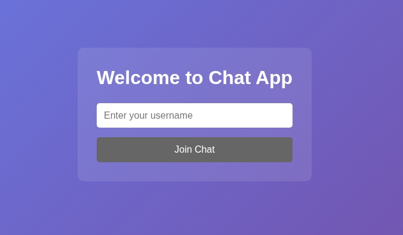
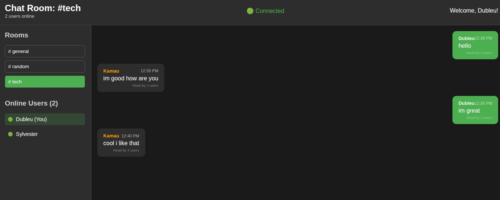

# Real-Time Chat Application

## 📋 Project Overview

A full-stack real-time chat application built with the MERN stack (MongoDB, Express.js, React, Node.js) and Socket.io. This application enables real-time messaging with advanced features like multiple chat rooms, typing indicators, message reactions, and user presence tracking.

### 🎯 Objective
Build a real-time chat application using Socket.io that demonstrates bidirectional communication between clients and server, implementing features like live messaging, notifications, and online status updates.

### 🏗️ Architecture
- **Frontend**: React with Vite, Socket.io Client
- **Backend**: Node.js, Express.js, Socket.io
- **Real-time Communication**: WebSockets via Socket.io
- **Styling**: CSS3 with modern responsive design

---

## 🚀 Setup Instructions

### Prerequisites
- Node.js (v18 or higher recommended)
- npm or yarn package manager

### Installation Steps

1. **Clone the Repository**
   ```bash
   git clone <your-repository-url>
   cd real-time-communication-with-socket-io
   ```

2. **Backend Setup**
   ```bash
   cd server
   npm install
   ```

3. **Frontend Setup**
   ```bash
   cd client
   npm install
   ```

4. **Environment Configuration**

   Create `server/.env`:
   ```env
   PORT=5000
   CLIENT_URL=http://localhost:5173
   ```

   Create `client/.env`:
   ```env
   VITE_SOCKET_URL=http://localhost:5000
   ```

5. **Start the Application**

   **Terminal 1 - Backend:**
   ```bash
   cd server
   npm run dev
   ```
   Server will run on: `http://localhost:5000`

   **Terminal 2 - Frontend:**
   ```bash
   cd client
   npm run dev
   ```
   Client will run on: `http://localhost:5173`

6. **Access the Application**
   Open your browser and navigate to: `http://localhost:5173`

---

## ✨ Features Implemented

### ✅ Task 1: Project Setup
- [x] Node.js server with Express
- [x] Socket.io configured on server side
- [x] React front-end application with Vite
- [x] Socket.io client setup in React app
- [x] Basic connection between client and server

### ✅ Task 2: Core Chat Functionality
- [x] **User Authentication**: Simple username-based authentication
- [x] **Global Chat Room**: All users can send and receive messages in real-time
- [x] **Message Display**: Messages show sender's name and timestamp
- [x] **Typing Indicators**: Real-time typing notifications
- [x] **Online/Offline Status**: Live user presence tracking

### ✅ Task 3: Advanced Chat Features
- [x] **Multiple Chat Rooms**: General, Random, and Tech rooms
- [x] **"User is Typing" Indicator**: Real-time typing notifications
- [x] **Private Messaging**: Direct messages between users
- [x] **Message Reactions**: Like, love, and other reactions
- [x] **Read Receipts**: See who has read your messages

### ✅ Task 4: Real-Time Notifications
- [x] **User Join/Leave Notifications**: System messages for user activity
- [x] **Typing Indicators**: Visual feedback when users are typing
- [x] **Message Delivery Confirmation**: Real-time delivery status

### ✅ Task 5: Performance and UX Optimization
- [x] **Reconnection Logic**: Automatic reconnection on disconnection
- [x] **Responsive Design**: Works on desktop and mobile devices
- [x] **Message History**: Previous messages loaded when joining rooms
- [x] **Optimized Socket.io**: Efficient room management and event handling

---

## 🎨 Application Screenshots
+
### Login Screen


*Clean, modern login interface with gradient background*

### Main Chat Interface



## 🛠️ Technical Features

### Real-time Events Handled
- **Connection Management**: User connect/disconnect
- **Message Broadcasting**: Real-time message delivery
- **Room Management**: Dynamic room joining/leaving
- **Typing Indicators**: Live typing status
- **User Presence**: Online/offline status tracking
- **Message Reactions**: Real-time reaction updates
- **Read Receipts**: Message read status

### Socket.io Events
```javascript
// Client to Server
socket.emit('user_join', userData);
socket.emit('send_message', messageData);
socket.emit('typing', isTyping);
socket.emit('join_room', roomName);
socket.emit('message_reaction', {messageId, reaction});

// Server to Client
socket.on('receive_message', message);
socket.on('user_joined', user);
socket.on('user_left', user);
socket.on('typing_users', users);
socket.on('previous_messages', messages);
```

---

## 📱 Responsive Design

The application is fully responsive and works seamlessly on:
- **Desktop** (1200px+)
- **Tablet** (768px - 1199px)
- **Mobile** (320px - 767px)

### Mobile Features
- Collapsible sidebar
- Touch-friendly buttons
- Optimized message display
- Responsive input fields

---

## 🔧 API Endpoints

### REST API
- `GET /api/rooms` - Get available chat rooms
- `GET /api/users` - Get online users
- `GET /api/messages/:room` - Get room messages with pagination
- `GET /api/search?q=query` - Search messages

### WebSocket Events
- Real-time message delivery
- User presence updates
- Typing indicators
- Room management
- Message reactions

---

## 🚀 Deployment

### Backend Deployment (Render/Railway/Heroku)
1. Set environment variables:
   ```env
   PORT=5000
   CLIENT_URL=<http://localhost:5173>
   ```

2. Deploy with build command: `npm start`

### Frontend Deployment (Vercel/Netlify)
1. Set environment variable:
   ```env
   VITE_SOCKET_URL=<http://localhost:5000>
   ```

2. Deploy with build command: `npm run build`

---

## 🎯 Future Enhancements

- [ ] File and image sharing
- [ ] Message search functionality
- [ ] User profiles and avatars
- [ ] Message pagination for older messages
- [ ] Voice and video calling
- [ ] Message encryption
- [ ] Chat bot integration
- [ ] Theme customization

---

## 📞 Support

For issues and questions:
1. Check the browser console for error messages
2. Verify both server and client are running
3. Ensure all environment variables are set
4. Check network connectivity between client and server

---

## 📄 License

This project is created as part of the PLP Academy Full-Stack Web Mern By Author Sylvester

---

**Built with ❤️ using React, Node.js, and Socket.io**